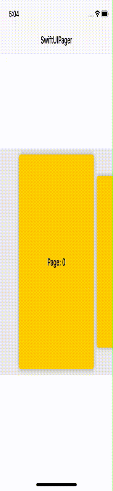

# SwiftUIPager

[](https://github.com/apple/swift-package-manager)
[](https://cocoapods.org/pods/SwiftUIPager)
[](https://opensource.org/licenses/MIT)

SwiftUIPager provides  a `Pager` component built with SwiftUI native components. `Pager` is a view that renders a scrollable container to display a handful of pages. These pages are recycled on scroll, so you don't have to worry about memory issues. 


## Requirements
* iOS 13.0+
* macOS 10.15+
* watchOS 6.0+
* Swift 5.1+

## Installation

### CocoaPods
```
pod 'SwiftUIPager'
```
### Swift Package Manager

Go to XCode:
* File -> Swift Packages -> Add Package Dependency...
* Use the URL https://github.com/fermoya/SwiftUIPager.git


## Usage

### Initialization

Creating a `Pager` is very simple. You just need to pass:
- `Binding` to page index
- Array of items that conform to `Equatable` and `Identifiable` 
- `ViewBuilder` factory method to create each page

```swift
 Pager(page: self.$pageIndex,
       data: self.items,
       content: { item in
           // create a page based on the data passed
           self.pageView(item)
 })
```

### UI customization

`Pager` is easily customizable through a number of view-modifier functions.  You can change the vertical insets, spacing between items or the page aspect ratio, among others:

```swift
Pager(...)
     .itemSpacing(10)
     .padding(8)
     .pageAspectRatio(0.6)
```
`pageAspectRatio` will change the look of the page. Use a value lower than 1 to make the page look like a card:


whereas a value greater than one will make it look like a box:


By default, `Pager` will create a horizontal container. Use `vertical` to create a vertical pager:

```swift
Pager(...)
    .vertical()
```


### Animations

Use `interactive` to pass a shrink ratio that will be applied to those components that are not focused, that is, those elements whose index is different from `pageIndex` binding:

```swift
Pager(...)
    .interactive(0.8)
```



You can also use `rotation3D` to add a rotation effect to your pages:

```swift
Pager(...)
    .itemSpacing(10)
    .rotation3D()
```


### Gestures

`Pager` comes with the following built-in gestures:
- Tap on any item to bring it to focus.
- Swipe acroos the items

### Events

Use `onPageChanged` to react to any change on the page index:

```swift
Pager(...)
     .onPageChanged({ (newIndex) in
         // do something
     })
```

### Sample projects

You can use `Pager` to implement cool effects as in [iPod](https://github.com/fermoya/iPod)


For more information, please check the [sample app](/Sample).

If you have any issues or feedback, please open an issue or reach out to me at [fmdr.ct@gmail.com](mailto:fmdr.ct@gmail.com).  
Please feel free to collaborate and make this framework better. 

## License  

`SwiftUIPager` is available under the MIT license. See the [LICENSE](/LICENSE) file for more info.
