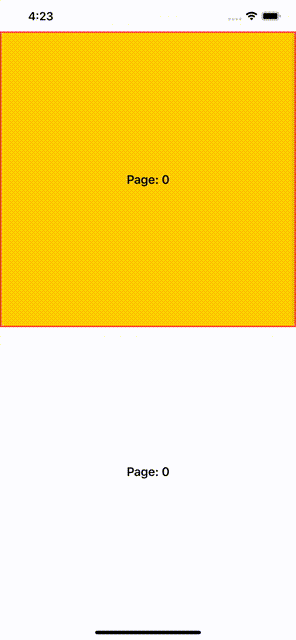
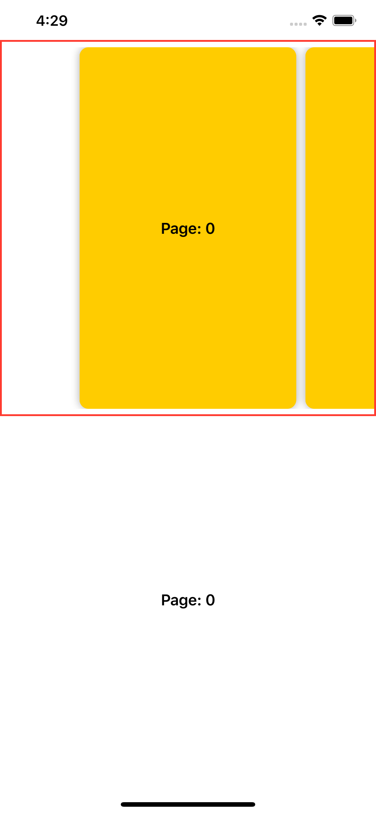
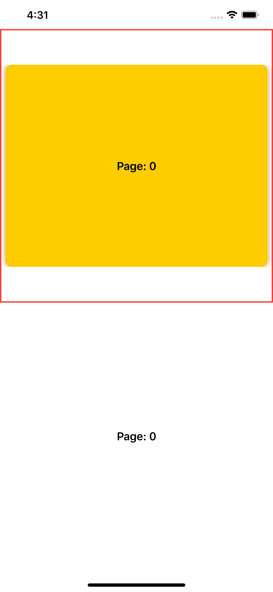
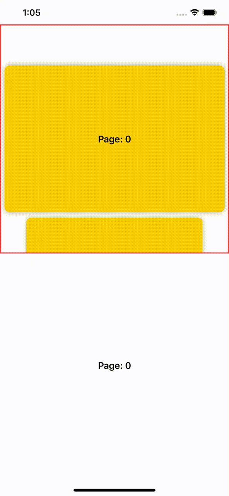
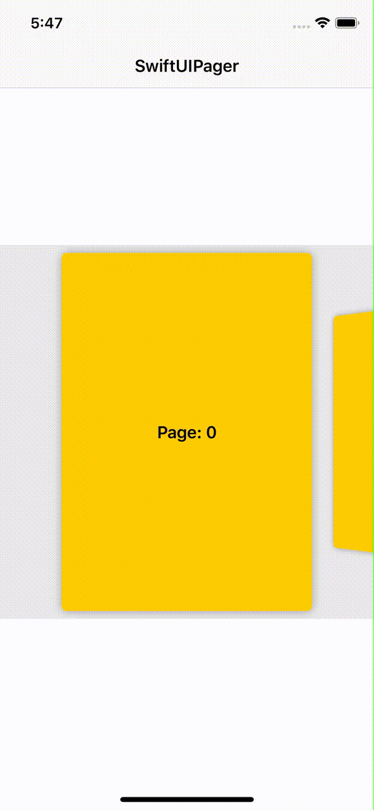
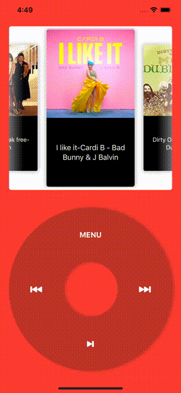

# SwiftUIPager

[](https://github.com/apple/swift-package-manager)
[](https://cocoapods.org/pods/SwiftUIPager)
[](https://github.com/Carthage/Carthage)
[](https://cocoapods.org/pods/SwiftUIPager)
[](https://opensource.org/licenses/MIT)

SwiftUIPager provides  a `Pager` component built with SwiftUI native components. `Pager` is a view that renders a scrollable container to display a handful of pages. These pages are recycled on scroll, so you don't have to worry about memory issues. 

Create vertical or horizontal pagers, align the cards, change the direction of the scroll, animate the pagintation... `Pager` lets you do anything you want.



## Requirements
* iOS 13.0+
* macOS 10.15+
* watchOS 6.0+
* Swift 5.1+

## Installation

### CocoaPods
```
pod 'SwiftUIPager'
```
### Swift Package Manager

Go to XCode:
* File -> Swift Packages -> Add Package Dependency...
* Use the URL https://github.com/fermoya/SwiftUIPager.git

### Carthage

```
github "fermoya/SwiftUIPager"
```

## Usage

### Initialization

Creating a `Pager` is very simple. You just need to pass:
- `Array` of items 
- `KeyPath` to an identifier.
- `ViewBuilder` factory method to create each page

```swift
Pager(page: $page
      data: items,
      id: \.identifier,
      content: { item in
           // create a page based on the data passed
           self.pageView(item)
 })
```

### UI customization

`Pager` is easily customizable through a number of view-modifier functions.  You can change the orientation, the direction of the scroll, the alignment, the space between items or the page aspect ratio, among others:

By default, `Pager` is configured as:
- Horizontal, left to right direction.
- Items have center alignment inside `Pager` and take all the space available
- Current page is centered in the scroll
- Only the page is hittable and reacts to swipes

Use `itemAspectRatio` to change the look of the page. Pass a value lower than 1 to make the page look like a card:



whereas a value greater than one will make it look like a box:



Add a position alignment to `itemAspectRatio` to specify the alignment inside `Pager`:

```swift
Pager(...)
     .itemSpacing(10)
     .padding(8)
     .itemAspectRatio(1.5, alignment: .end)
```


By default, `Pager` will create a horizontal container. Use `vertical` to create a vertical pager:

```swift
Pager(...)
    .vertical()
```



You can customize the alignment and the direction of the scroll. For instance, you can have a horizontal `Pager` that scrolls right-to-left that it's aligned at the start of the scroll:

```swift
Pager(...)
    .itemSpacing(10)
    .alignment(.start)
    .horizontal(.rightToLeft)
    .itemAspectRatio(0.6)
```


### Animations

Use `interactive` add a scale animation effect to those pages that are unfocused, that is, those elements whose index is different from `pageIndex`:

```swift
Pager(...)
    .interactive(0.8)
```


You can also use `rotation3D` to add a rotation effect to your pages:

```swift
Pager(...)
    .itemSpacing(10)
    .rotation3D()
```



### Events

Use `onPageChanged` to react to any change on the page index:

```swift
Pager(...)
     .onPageChanged({ (newIndex) in
         // do something
     })
```

### Sample projects

You can use `Pager` to implement cool effects as in [iPod](https://github.com/fermoya/iPod)



For more information, please check the [sample app](/Example).

If you have any issues or feedback, please open an issue or reach out to me at [fmdr.ct@gmail.com](mailto:fmdr.ct@gmail.com).  
Please feel free to collaborate and make this framework better. 

## License  

`SwiftUIPager` is available under the MIT license. See the [LICENSE](/LICENSE) file for more info.
