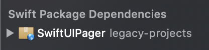

# SwiftUIPager

[](https://github.com/apple/swift-package-manager)
[](https://cocoapods.org/pods/SwiftUIPager)
[](https://github.com/Carthage/Carthage)
[](https://cocoapods.org/pods/SwiftUIPager)
[](https://opensource.org/licenses/MIT)

_SwiftUIPager_ provides  a `Pager` component built with SwiftUI native components. `Pager` is a view that renders a scrollable container to display a handful of pages. These pages are recycled on scroll, so you don't have to worry about memory issues. `Pager` will load just a handful of items, enough to beatifully scroll along.

Create vertical or horizontal pagers, align the cards, change the direction of the scroll, animate the pagintation... `Pager` lets you do anything you want.


- [Requirements](#requirements)
- [Installation](#installation)
    - [Cocoapods](#cocoapods)
    - [Swift Package Manager](#swift-package-manager)
    - [Carthage](#carthage)
    - [Manually](#manually)
- [Legacy projects support](#legacy-projects-support)
- [Usage](#usage)
    - [Initialization](#initialization)
    - [UI customization](#ui-customization)
    - [Configure your page size](#configure-your-page-size)
    - [Orientation and direction](#orientation-and-direction)
    - [Alignment](#alignment)
    - [Animations](#animations)
        - [Scale](#scale)
        - [Rotation](#rotation)
        - [Loop](#loop)
    - [Add pages on demand](#add-pages-on-demand)
    - [Examples](#examples)
- [Support Open Source](#support-open-source)
        
## Requirements
* iOS 13.0+
* macOS 10.15+
* watchOS 6.0+
* tvOS 13.0+
* Swift 5.1+

## Installation

### CocoaPods
```
pod 'SwiftUIPager'
```
### Swift Package Manager

In Xcode:
* File ⭢ Swift Packages ⭢ Add Package Dependency...
* Use the URL https://github.com/fermoya/SwiftUIPager.git

### Carthage

```
github "fermoya/SwiftUIPager"
```

### Manually
* Download _[SwiftUIPager.xcframework](SwiftUIPager.xcframework)_
* Create a group _Frameworks_ inside your project and drag and drop _SwiftUIPager.xcframework_


* Make sure in your target's build phases that it's embedded and signed:


## Legacy projects support
If your App doesn't comply with the system version [requirements](#requirements), you can still use _SwiftUIPager_.

**Cocoapods**
```
pod 'SwiftUIPager', :git => 'https://github.com/fermoya/SwiftUIPager.git', :branch => 'legacy-projects'
```

**Swift Package Manager**
* File ⭢ Swift Packages ⭢ Add Package Dependency...
* Use the URL https://github.com/fermoya/SwiftUIPager.git
* Select branch _legacy-projects_




## Usage

### Initialization

Creating a `Pager` is very simple. You just need to pass:
- `Array` of items 
- `KeyPath` to an identifier.
- `ViewBuilder` factory method to create each page

```swift
Pager(page: $page
      data: items,
      id: \.identifier,
      content: { item in
           // create a page based on the data passed
           self.pageView(item)
 })
```

### UI customization

`Pager` is easily customizable through a number of view-modifier functions.  You can change the orientation, the direction of the scroll, the alignment, the space between items or the page aspect ratio, among others:

By default, `Pager` is configured as:
- Horizontal, left to right direction.
- Items have center alignment inside `Pager` and take all the space available
- Current page is centered in the scroll
- Only the page is hittable and reacts to swipes
- Finite, that is, it doesn't loop the pages

#### Configure your page size

There are two ways to achieve this. You can use `preferredItemSize` to let `Pager` know which size your items should have. The framework will automatically calculate the `itemAspectRatio` and the necessary `padding` for you. You can also use `itemAspectRatio` to change the look of the page. Pass a value lower than 1 to make the page look like a card:


whereas a value greater than one will make it look like a box:


#### Orientation and direction

By default, `Pager` will create a horizontal container. Use `vertical` to create a vertical pager:

```swift
Pager(...)
    .vertical()
```


Pass a direction to `horizontal` or `vertical` to change the scroll direction. For instance, you can have a horizontal `Pager` that scrolls right-to-left:

```swift
Pager(...)
    .itemSpacing(10)
    .alignment(.start)
    .horizontal(.rightToLeft)
    .itemAspectRatio(0.6)
```


#### Alignment

Pass a position to `itemAspectRatio` or `preferredItemSize` to specify the alignment along the vertical / horizontal axis for a horizontal / vertical `Pager`. Change its position along the horizontal / vertical  axis of a horizontal / vertical `Pager` by using `alignment`: 

```swift
Pager(...)
     .itemSpacing(10)
     .horizontal()
     .padding(8)
     .itemAspectRatio(1.5, alignment: .end)    // will move the items to the bottom of the container
     .alignment(.center)                       // will align the first item to the leading of the container
```


### Animations

#### Scale

Use `interactive` to add a scale animation effect to those pages that are unfocused, that is, those elements whose index is different from `pageIndex`:

```swift
Pager(...)
    .interactive(0.8)
```


#### Rotation

You can also use `rotation3D` to add a rotation effect to your pages:

```swift
Pager(...)
    .itemSpacing(10)
    .rotation3D()
```


#### Loop

Transform your `Pager` into an endless sroll by using `loopPages`:


### Events

Use `onPageChanged` to react to any change on the page index:

```swift
Pager(...)
     .onPageChanged({ (newIndex) in
         // do something
     })
```

### Add pages on demand

You can use `onPageChanged` to add new items on demand whenever the user is getting to the last page:

```swift

@State var page: Int = 0
@State var data = Array(0..<5)

var body: some View {
    Pager(...)
        .onPageChanged({ page in
            guard page == self.data.count - 2 else { return }
            guard let last = self.data.last else { return }
            let newData = (1...5).map { last + $0 }
            withAnimation {
                self.data.append(contentsOf: newData)
            }
        })
}
```

### Examples

For more information, please check the [sample app](/Example). There are included several common use-cases:

- See [`InfiniteExampleView`](/Example/SwiftUIPagerExample/Examples/InfiniteExampleView.swift) for more info about `loopPages` and using `onPageChanged` to add items on the fly.
- See [`ColorsExampleView`](/Example/SwiftUIPagerExample/Examples/ColorsExampleView.swift) for more info about event-driven `Pager`.
- See [`EmbeddedExampleView`](/Example/SwiftUIPagerExample/Examples/EmbeddedExampleView.swift) for more info about embedding `Pager` into a `ScrollView`.
- See [`NestedExampleView`](/Example/SwiftUIPagerExample/Examples/NestedExampleView.swift) for more info about nesting `Pager`.
- See [`BizarreExampleView`](/Example/SwiftUIPagerExample/Examples/BizarreExampleView.swift) for more info about other features of `Pager`.

If you have any issues or feedback, please open an issue or reach out to me at [fmdr.ct@gmail.com](mailto:fmdr.ct@gmail.com).  
Please feel free to collaborate and make this framework better. 


## Support Open Source

If you love the library, understand all the effort it takes to maintain it and would like to  support me, you can buy me a coffee by following this [link](https://www.buymeacoffee.com/fermoya):

<a href="https://www.buymeacoffee.com/fermoya" target="_blank"></a>

All help is very much appreciated.

## License  

`SwiftUIPager` is available under the MIT license. See the [LICENSE](/LICENSE) file for more info.
