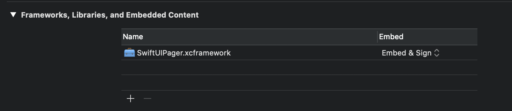

# SwiftUIPager

[](https://github.com/apple/swift-package-manager)
[](https://cocoapods.org/pods/SwiftUIPager)
[](https://github.com/Carthage/Carthage)
[](https://cocoapods.org/pods/SwiftUIPager)
[](https://opensource.org/licenses/MIT)

_SwiftUIPager_ provides  a `Pager` component built with SwiftUI native components. `Pager` is a view that renders a scrollable container to display a handful of pages. These pages are recycled on scroll, so you don't have to worry about memory issues. `Pager` will load just a handful of items, enough to beatifully scroll along.

Create vertical or horizontal pagers, align the cards, change the direction of the scroll, animate the pagintation... `Pager` lets you do anything you want.

- [Requirements](#requirements)
- [Installation](#installation)
    - [Cocoapods](#cocoapods)
    - [Swift Package Manager](#swift-package-manager)
    - [Carthage](#carthage)
    - [Manually](#manually)
- [Legacy projects support](Documentation/Legacy.md)
- [Usage](Documentation/Usage.md)
    - [Initialization](Documentation/Usage.md#initialization)
    - [UI customization](Documentation/Usage.md#ui-customization)
    - [Configure your page size](Documentation/Usage.md#configure-your-page-size)
    - [Orientation and direction](Documentation/Usage.md#orientation-and-direction)
    - [Alignment](Documentation/Usage.md#alignment)
    - [Animations](Documentation/Usage.md#animations)
        - [Scale](Documentation/Usage.md#scale)
        - [Rotation](Documentation/Usage.md#rotation)
        - [Loop](Documentation/Usage.md#loop)
    - [Add pages on demand](Documentation/Usage.md#add-pages-on-demand)
    - [Examples](Documentation/Usage.md#examples)
- [Support Open Source](#support-open-source)
- [License](#license)


        
## Requirements
* iOS 13.0+
* macOS 10.15+
* watchOS 6.0+
* tvOS 13.0+
* Swift 5.1+

## Installation

### CocoaPods
```ruby
pod 'SwiftUIPager'
```
### Swift Package Manager

In Xcode:
* File ⭢ Swift Packages ⭢ Add Package Dependency...
* Use the URL https://github.com/fermoya/SwiftUIPager.git

### Carthage

```swift
github "fermoya/SwiftUIPager"
```

### Manually
* Download _[SwiftUIPager.xcframework](SwiftUIPager.xcframework)_
* Create a group _Frameworks_ inside your project and drag and drop _SwiftUIPager.xcframework_


* Make sure in your target's build phases that the option _Embed & Sign_ is selected:



## Support Open Source

If you love the library, understand all the effort it takes to maintain it and would like to  support me, you can buy me a coffee by following this [link](https://www.buymeacoffee.com/fermoya):

<a href="https://www.buymeacoffee.com/fermoya" target="_blank"></a>

All help is very much appreciated.

## License  

`SwiftUIPager` is available under the MIT license. See the [LICENSE](/LICENSE) file for more info.
